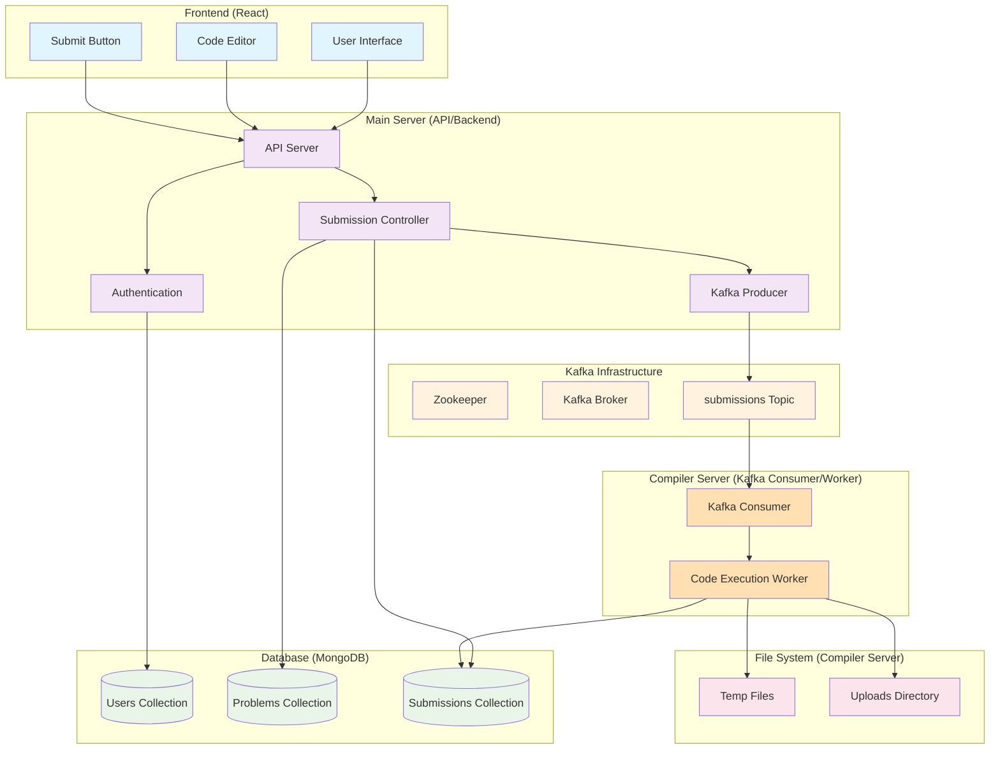
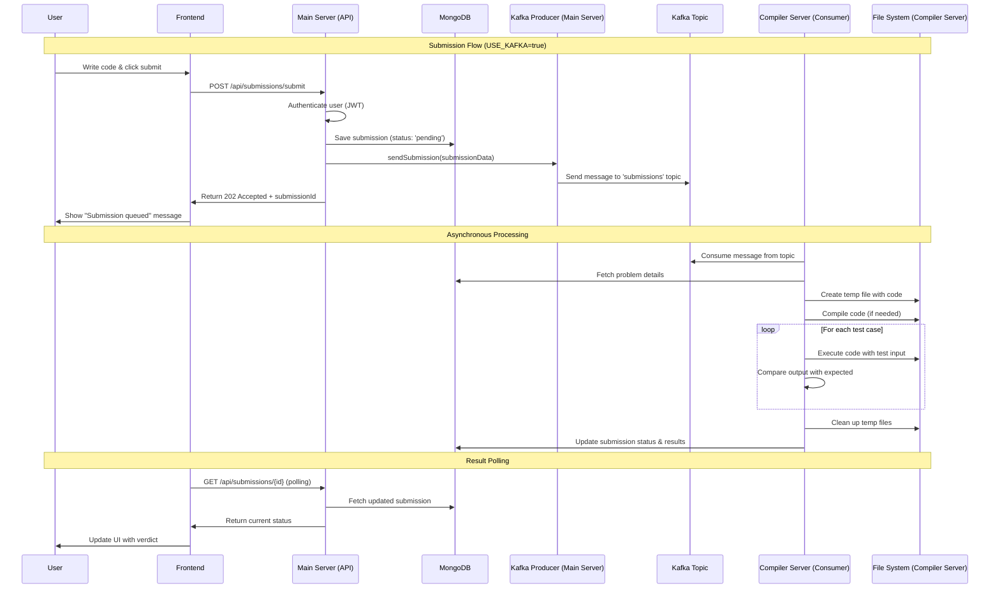
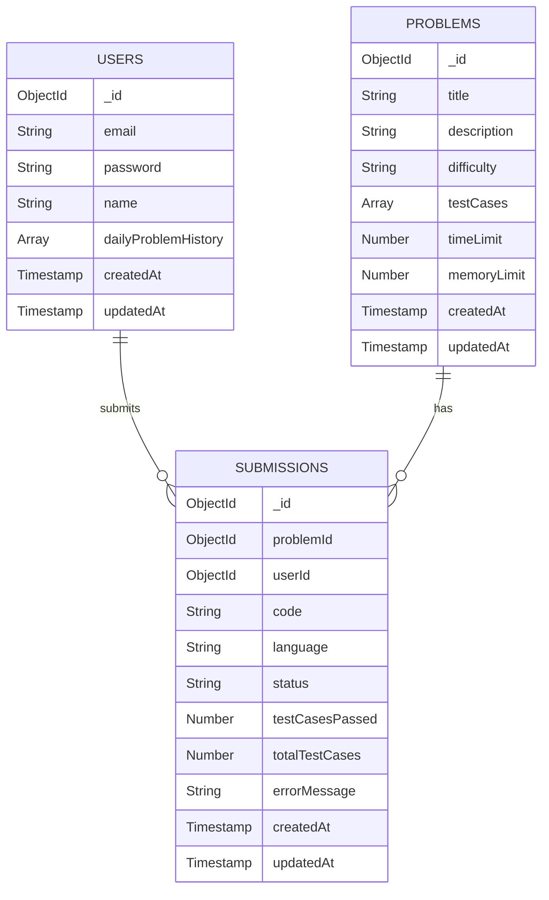

# Kafka Architecture Diagram - Code Judge System

## System Architecture Overview



## Detailed Data Flow Sequence



## Synchronous vs Asynchronous Mode

```mermaid
flowchart TD
    Start([User Submits Code]) --> CheckMode{Mode?}
    
    CheckMode -->|"run"| RunMode[Execute & Return Output (Main Server)]
    CheckMode -->|"submit"| CheckKafka{USE_KAFKA?}
    
    CheckKafka -->|"true"| AsyncMode[Asynchronous Mode (Compiler Server)]
    CheckKafka -->|"false"| SyncMode[Synchronous Mode (Main Server)]
    
    AsyncMode --> SaveDB[Save to DB (pending) (Main Server)]
    AsyncMode --> SendKafka[Send to Kafka Topic (Main Server)]
    AsyncMode --> Return202[Return 202 Accepted (Main Server)]
    AsyncMode --> PollResults[Frontend Polls for Results]
    
    SyncMode --> ExecuteCode[Execute Code Immediately (Main Server)]
    SyncMode --> UpdateDB[Update DB with Results (Main Server)]
    SyncMode --> ReturnResults[Return Results Directly (Main Server)]
    
    RunMode --> ReturnOutput[Return Output to User]
    Return202 --> PollResults
    PollResults --> CheckStatus{Status Updated?}
    CheckStatus -->|"No"| PollResults
    CheckStatus -->|"Yes"| ShowResults[Show Results to User]
    
    ExecuteCode --> UpdateDB
    UpdateDB --> ReturnResults
    ReturnResults --> ShowResults
    ReturnOutput --> End([End])
    ShowResults --> End
```

## Kafka Topic Structure

```mermaid
graph LR
    subgraph "Kafka Topic: submissions"
        Partition[Partition 0]
    end
    
    subgraph "Message Format"
        Message[{"_id": "submission_id", "userId": "user_id", "problemId": "problem_id", "code": "source_code", "language": "cpp|java|python"}]
    end
    
    Producer -.-> Partition
    Partition -.-> Consumer
    Message -.-> Partition
```

## Database Schema Relationships



## Component Interaction Details

### Main Server (API/Backend)
- Handles API requests, authentication, and database operations
- Sends submissions to Kafka topic as producer
- Returns immediate response to frontend

### Compiler Server (Kafka Consumer/Worker)
- Consumes submissions from Kafka topic
- Executes and judges code, updates submission status in DB
- Handles all file system operations for code execution

### Database Operations
- **Write Operations**: Create submission, update status
- **Read Operations**: Fetch problem details, get submission status
- **Indexes**: Optimized for submission queries and user progress tracking

This architecture provides:
- **Scalability**: Handle multiple concurrent submissions
- **Reliability**: Fault-tolerant message processing
- **Performance**: Quick API responses with background processing
- **Flexibility**: Easy switching between sync/async modes 